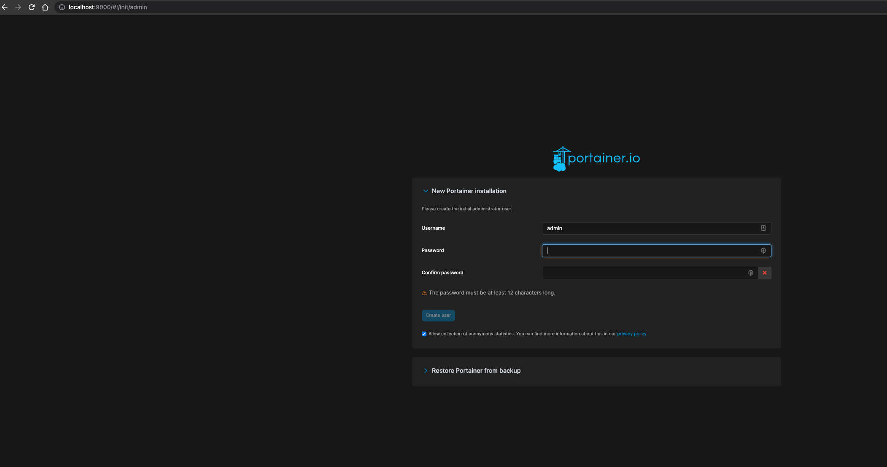
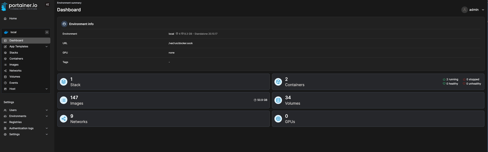

# Portainer docker container

This is a docker container for Portainer. Portainer is a lightweight management UI which allows you to easily manage your different Docker environments (Docker hosts or Swarm clusters).

This container is based on the official Portainer image and adds a few features:

- Automatic update of Portainer to the latest version
- Automatic update of the Portainer agent to the latest version
- Automatic update of the Portainer agent on all Docker hosts
- Automatic update of the Portainer agent on all Docker Swarm clusters
- Automatic update of the Portainer agent on all Docker Swarm clusters when a new node is added to the cluster
- Automatic update of the Portainer agent on all Docker Swarm clusters when a node is removed from the cluster
- Automatic update of the Portainer agent on all Docker Swarm clusters when a node is updated in the cluster

## Usage

Stop all running containers 
```bash
docker stop $(docker ps -a -q)
 ```

Remove all containers

```bash
docker rm $(docker ps -a -q)
 ```

### Docker

```bash
docker-compose up -d
```

### Docker Swarm

```bash
docker stack deploy -c docker-compose.yml portainer
```

# Portainer

Launch portainer UI on http://localhost:9000






## :postbox: Contacts
[beemi.raja@gmail.com](mailto:beemi.raja@gmail.com)
